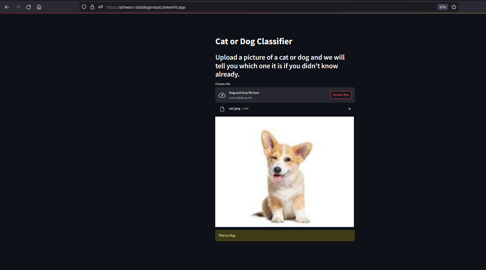

# IsItADogOrACat
## A Cat or Dog Classifier

Welcome to the Cat or Dog Classifier, a deep learning model trained in TensorFlow and deployed on Streamlit!

## Overview

This classifier uses a deep neural network model trained on a dataset containing images of cats and dogs. The model is capable of distinguishing between cats and dogs with high accuracy of 80%.

## Usage
To use the Cat or Dog Classifier, simply visit https://schwarz-isitadogoracat.streamlit.app/ and upload a photo of of a dog or a cat to know which it is.

## Technology Stack

    TensorFlow: Deep learning framework used for model training and prediction.
    Streamlit: Web application framework used for deploying the model.
    Python: Programming language used for model development and deployment.
